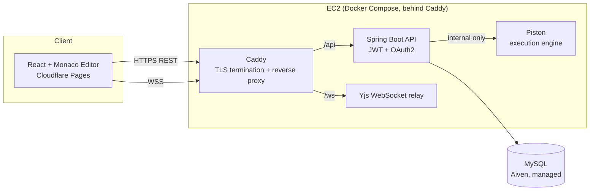

# Collaborative Code Editor

A real-time collaborative code editor with live multi-user editing, role-based access control, and in-browser code execution — built end to end, from schema design through production deployment.

**Live demo:** [collaborative-code-editor.pages.dev](https://collaborative-code-editor.pages.dev)

---

## Screenshots


---

## Overview

This project is a browser-based IDE that lets multiple people write and run code together in real time, inside shared repositories with folders, files, and permission-based access — similar in spirit to a lightweight, self-hosted mix of Google Docs and an online judge, purpose-built for code.

It was built as a full-stack, self-deployed system rather than a framework demo: the backend, real-time layer, execution sandbox, and database all run as independent services, wired together with a reverse proxy, CI/CD, and a managed database — the same shape a small real production system would take.

## Key Features

**Collaboration**
- Real-time multi-user editing powered by [Yjs](https://github.com/yjs/yjs) CRDTs over WebSocket — conflict-free by design, no last-write-wins races
- Live presence: avatars for everyone currently viewing a file, plus colored cursors and selection highlights per user
- Debounced autosave with a quiet, non-intrusive save indicator

**Access control**
- Email/password auth plus OAuth login via Google and GitHub
- Repository-level roles — `VIEWER`, `EDITOR`, `ADMIN` — enforced on every mutating endpoint, not just hidden in the UI
- Invitation flow with accept/decline, duplicate-invite prevention

**File & folder management**
- Nested folder trees with GitHub-style breadcrumb navigation
- Rename, move, and delete (with confirmation) for files and folders
- Recursive folder deletion handled safely server-side

**Code execution**
- In-browser "Run" with live stdout/stderr, exit codes, and custom stdin input
- Multi-file execution — imports between files in the same repo resolve correctly (folder structure preserved), not just single-script running
- Python, C++, and C# supported, via a self-hosted [Piston](https://github.com/engineer-man/piston) execution engine (kept off the public internet — reachable only from the backend over the internal Docker network)

## Architecture



- **Frontend** — React + Vite, Monaco Editor, deployed on Cloudflare Pages with automatic deploys on push
- **Backend** — Spring Boot REST API, Spring Security (JWT + OAuth2), JPA/Hibernate
- **Real-time layer** — a standalone Node.js service running `y-websocket`, kept separate from the main API so the collaboration layer can be deployed and scaled independently
- **Execution engine** — self-hosted Piston, isolated on the internal Docker network only
- **Database** — MySQL, hosted on Aiven
- **Reverse proxy** — Caddy, handling automatic HTTPS (Let's Encrypt) and routing `/ws` traffic to the WebSocket service and everything else to the API
- **CI/CD** — GitHub Actions builds and pushes Docker images to GitHub Container Registry on every push to `backend/` or `websocket-relay/`, then deploys to the EC2 host automatically

## Tech Stack

| Layer | Technology |
|---|---|
| Frontend | React, Vite, Monaco Editor, Yjs, y-websocket, y-monaco |
| Backend | Java 17, Spring Boot, Spring Security, Hibernate/JPA |
| Real-time | Node.js, `ws`, `y-websocket` |
| Database | MySQL (Aiven) |
| Execution | Piston (self-hosted, Docker) |
| Infra | Docker, Docker Compose, Caddy, AWS EC2, Cloudflare Pages |
| CI/CD | GitHub Actions, GitHub Container Registry |

## Getting Started (local development)

**Prerequisites:** Java 17, Node.js, Docker & Docker Compose, Maven.

```bash
git clone https://github.com/mohammadyousef134/CollaborativeCodeEditor.git
cd CollaborativeCodeEditor
```

**1. Start the supporting services** (MySQL + Piston):
```bash
docker-compose up -d mysql piston
```

**2. Install a language runtime into Piston** (repeat for any language you need):
```bash
curl -X POST http://localhost:2000/api/v2/packages \
  -H "Content-Type: application/json" \
  -d '{"language":"python","version":"3.10.0"}'
```

**3. Run the backend:**
```bash
cd backend
./mvnw spring-boot:run
```
Configure `application.properties` with your DB credentials, JWT secret, and OAuth client IDs (see `application.properties.example` if present, or the environment variables referenced in `docker-compose.yml`).

**4. Run the WebSocket relay:**
```bash
cd websocket-relay
npm install
node server.cjs
```

**5. Run the frontend:**
```bash
cd frontend
npm install
npm run dev
```

The app will be available at `http://localhost:5173`.

## Project Structure

```
├── backend/            Spring Boot API
├── frontend/            React + Vite client
├── websocket-relay/    Standalone Yjs WebSocket server
├── docker-compose.yml  Orchestrates backend, piston, mysql (local dev)
└── .github/workflows/  CI/CD: build, push, deploy on push
```

## Design Notes

A few deliberate decisions worth calling out:

- **Roles are enforced server-side**, not just hidden in the UI — a `VIEWER` hitting a mutating endpoint directly gets rejected regardless of what the frontend shows.
- **Piston is never exposed publicly.** It executes arbitrary user code with no authentication of its own, so it's only reachable from the backend over Docker's internal network — never bound to a public port in production.
- **Execution bundles same-language files together**, preserving folder structure, so `import`/`#include`-style references between files in a repo resolve the same way they would on a real filesystem — not just single-file "run this script."
